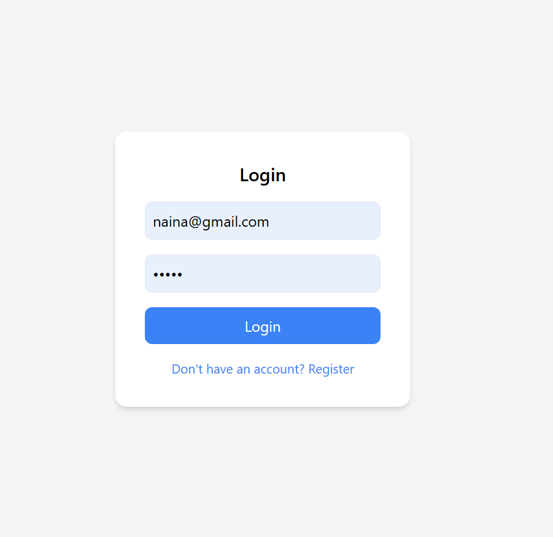
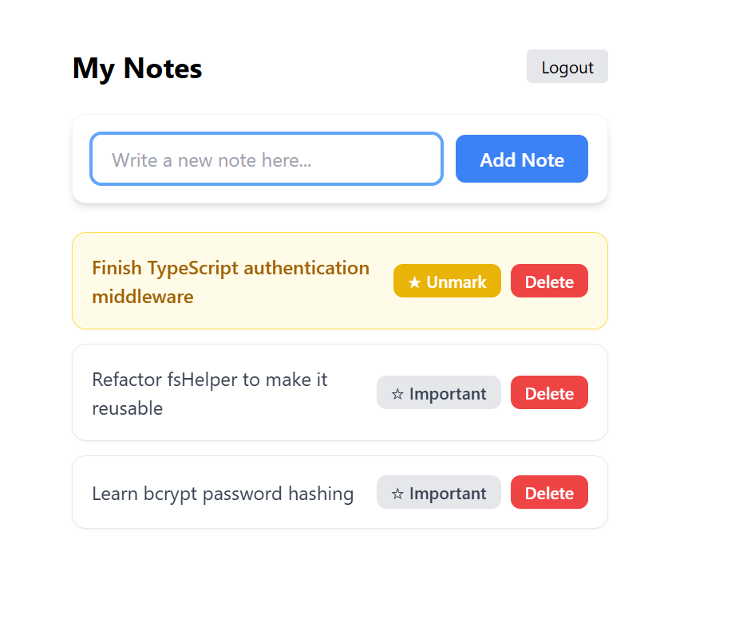

# TypeScript Notes API


> A Notes REST API built with Node.js, Express, and TypeScript — my first TypeScript learning project.

This project explores backend architecture, JWT authentication, middleware-based route protection, and user-specific data handling using file-based JSON storage (no database).

---

## Features

- User Registration & Login
- JWT Authentication
- Protected Routes via Middleware
- User-Specific Notes (users only see their own)
- Full CRUD — Create, Read, Update, Delete Notes
- Toggle Note Importance via path parameter (`PATCH /notes/:id/importance`)
- File-based JSON Storage (no database required)

---

## Tech Stack

| Layer | Tech |
|-------|------|
| Runtime | Node.js |
| Framework | Express |
| Language | TypeScript |
| Auth | JSON Web Token (JWT) |
| Storage | File System (JSON) |
| Frontend | React + TypeScript + Tailwind CSS |

---

## Project Structure

```
ToDo/
├── backend/
│   ├── entities/         # Type definitions & interfaces
│   ├── features/         # Business logic
│   ├── routes/           # API route handlers
│   ├── middleware/       # Auth & validation middleware
│   ├── shared/           # Shared utilities
│   └── data/             # JSON storage files
│
└── frontend/
    ├── components/       # React components
    ├── services/         # API service calls
    └── src/              # App entry point
```

---

## Authentication Flow

```
Register → Login → Receive JWT → Store in localStorage
       → Send token in Authorization header
       → Middleware verifies token
       → Access user-specific notes
```

---

## Screenshots

<div align="center">

| Login | Notes |
|-------|-------|
|  |  |

</div>

---

## Getting Started

**1. Clone the repo**

```bash
git clone https://github.com/NainaKothari-14/typescript-notes.git
cd ToDo
```

**2. Start the Backend**

```bash
cd backend
npm install
npm run dev
```

Runs on → `http://localhost:3001`

**3. Start the Frontend**

```bash
cd frontend
npm install
npm start
```

Runs on → `http://localhost:3000`

---

## What I Learned

- Setting up a TypeScript backend with Express
- Creating reusable file-based data helpers
- Implementing JWT authentication from scratch
- Protecting routes with custom middleware
- Handling user-specific data securely
- Connecting a React frontend with an authenticated backend
- Managing component state and side effects using `useState`, `useEffect`, and `useRef`

---

## Future Improvements

- [ ] Password hashing with bcrypt
- [ ] Refresh token implementation
- [ ] Better error handling middleware
- [ ] Migration to MongoDB or PostgreSQL
- [ ] Improved UI/UX

---

## Note

This is a learning project built while exploring TypeScript and backend development concepts for the first time.

---

## License

This project is licensed under the [MIT License](LICENSE).
